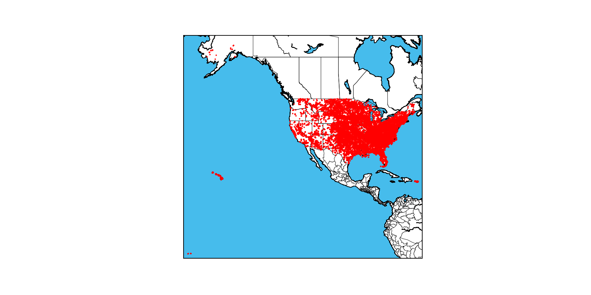

# Jupyter Geos 

Notebook Created to visualize CVS Storm data on Basemap generated maps using Jupyter Notebook 

## How to

Please make sure to take a look at the [HOW-TO.md](HOW-TO.md) document.
# JupyterNotebook-Geos
